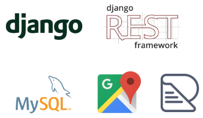

&nbsp;

# 길잡이 / Gil-Job-E 

>  IT 관련 채용과 회사 정보를 지도에서 보여주자

- feature 1

  explain 1

- feature 2

  explain 2

&nbsp;

##### Use our service. [http://recruitmap.ninja/](http://recruitmap.ninja/)

&nbsp;

## 1. Service Feature

#### 1) detail feature

- detail feature explain

#### 2) detail feature

- detail feature explain

#### 3) detail feature

- detail feature explain

#### 4) detail feature

- detail feature explain

#### 5) detail feature

- detail feature explain

&nbsp;

## 2. Tech Stack


#### Deploy

Deploying separated Server & Client & DB

* AWS EC2
* AWS RDS
* Nginx
* uWSGI

&nbsp;


#### Frontend

Search engine optimized SSR / SPA with Nuxt.js

- Vue.js
- Nuxt.js
- Vuex
- Sass
- Google Maps

&nbsp;



#### Backend

 Hypermedia-driven REST API with Django REST framework 

- Django
- Django REST framework
- MySQL
- Google Maps
- Redoc(drf-yasg)

&nbsp;

## 3. Deployed Service or Local Install

#### 1) Deployed Service

[AWS](https://aws.amazon.com/) 을 이용해 배포했습니다.

- [Go to Gil-Job-E](http://recruitmap.ninja/)

#### 2) Local Installation and Run Server

1. Installation

   - Git Clone

       ```bash
        git clone https://github.com/jiwookseo/gil-job-e.git
       ```

   - or [Download ZIP](https://github.com/jiwookseo/gil-job-e/archive/develop.zip)

   &nbsp;
   
2. Settings

   *  환경 변수 설정

        아래와 같은 사람인, Google API key 와 MySQL 비밀번호를
   
         `~/.bashrc` ,  `~/.zshrc` 같은 Shell environment 에 추가해줍니다.
        
        ```
	    export SARAMIN_KEY="<your-key>"
	    export GOOGLE_MAPS_KEY="<your-key>"
	    export DJANGO_SECRET_KEY="<your-key>"
	    export MYSQL_PASSWORD="<your-password>" # SQLite3 사용 시 없어도 됩니다.
	    ```
	
	    &nbsp;
	
	* Backend 설정
	
	    backend directory 로 이동합니다.
	
	    ```bash
	    cd backend
	    ```
	
	    &nbsp;
	
	    `backend/backend/settings.py` 의 `DATABASES` 의 default host 부분을 알맞게 수정해줍니다.
	
	    MySQL 사용 시 주석 처리된 SQLite3 설정을 사용합니다.
	
	    ```python
	    DATABASES = {
	        # 'default': {
	        #     'ENGINE': 'django.db.backends.sqlite3',
	        #     'NAME': os.path.join(BASE_DIR, 'db.sqlite3'),
	        # }
	        'default': {
	            'ENGINE': 'django.db.backends.mysql',
	            'NAME': 'nonamed',
	            'USER': 'root',
	            'PASSWORD': os.getenv('MYSQL_PASSWORD'),
	            'HOST': 'nonamed.cf94mqktvsr3.ap-northeast-2.rds.amazonaws.com',
	            'PORT': '3306',
	            'OPTIONS': {
	                'init_command': "SET sql_mode='STRICT_TRANS_TABLES'"
	            }
	        }
	    }
	    ```
	
	    &nbsp;

	    `pip install` 명령어를 통해 `requirements.txt` 에 저장된 의존성 패키지를 설치합니다.
   
	    ```bash
       pip install -r requirements.txt
       ```
   
       &nbsp;
   
       migrate를 한 뒤 Django 프로젝트를 실행합니다.
   
       ```bash
       python manage.py makemigrations
       python manage.py migrate
       python manage.py runserver
       ```
   
   &nbsp;
   
   *  Frontend 설정
   
       frontend directory 로 이동합니다.
   
       ```bash
       cd frontend
       ```
   
       &nbsp;
   
       `api/company.js` ,  `api/station.js` 의 `BASE_URL`을 `localhost` 로 변경해줍니다.
	    
	    ```js
	    const BASE_URL = 'http://recruitmap.ninja:8000/api/' // from
       const BASE_URL = 'http://localhost:8000/api/' // to
       ```
       
       &nbsp;
       
       `yarn` 명령어를 통해 의존성 패키지를 설치하고 Nuxt 서버를 실행합니다.
       
       ```bash
       yarn
       yarn dev
       ```
       


